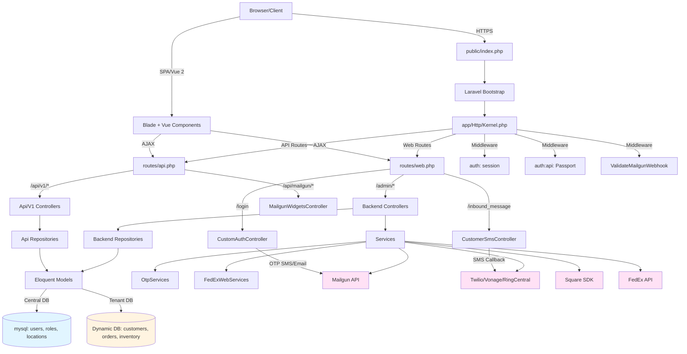

# Detailed Architecture

This document provides a comprehensive view of the Boca 340B Insights system architecture.

## Detailed Architecture Diagram



**Legend:**
- 🔵 **Blue**: Central database (shared across tenants)
- 🟡 **Yellow**: Tenant databases (per-location)
- 🟣 **Pink**: External services

## Component Layers

### 1. Presentation Layer (UI)
- **Blade Templates**: Server-rendered views (`resources/views/`)
- **Vue 2**: Client-side components (compiled via Laravel Mix)
- **Bootstrap 4 + CoreUI**: Admin UI framework
- **jQuery + DataTables**: Data table interactions

### 2. Routing Layer
- **`routes/web.php`**: Main web router (includes backend/frontend routes)
- **`routes/api.php`**: API router (Passport protected)
- **`routes/backend/*.php`**: Backend module route files (Customers, Orders, Billing, etc.)

### 3. Controller Layer
- **`App\Http\Controllers\Backend\*`**: Admin panel controllers
- **`App\Http\Controllers\Frontend\*`**: Public-facing controllers
- **`App\Http\Controllers\Api\V1\*`**: REST API controllers
- **`App\Http\Controllers\CustomAuthController`**: Custom OTP login flow

### 4. Repository Layer
- **`app/Repositories/Backend/`**: Data access abstraction for backend modules
- **`app/Repositories/Frontend/`**: Data access abstraction for frontend modules

### 5. Service Layer
- **`app/Services/`**: General business logic services
- **`app/OtpServices/`**: OTP generation and validation
- **`app/FedExWebServices/`**: FedEx shipping integration wrapper

### 6. Model Layer (Eloquent ORM)
- **Central DB Models**: `User`, `Location`, `Role`, `Permission` (use `mysql` connection)
- **Tenant DB Models**: `Customer`, `Order`, `Product`, `Inventory` (dynamic connection via `session('userLocation')->db_connection`)

### 7. Middleware Layer
- **`admin` middleware group**: Requires `auth` (session authentication)
- **`api` middleware group**: Requires `auth:api` (Passport OAuth)
- **`ValidateMailgunWebhook`**: Webhook signature validation

### 8. External Integrations
- **Mailgun**: Email + SMS
- **Twilio/Vonage/RingCentral**: SMS/telephony
- **FedEx**: Shipping integration
- **Square**: Payment processing
- **PDF/Excel**: Reporting (DomPDF, TCPDF, maatwebsite/excel)

## Multi-Database Architecture

### Central Database (`mysql` connection)
Stores cross-tenant configuration:
- `users` - User accounts
- `roles`, `permissions` - Spatie Permission (RBAC)
- `locations` - Facility metadata (includes `db_connection`, `mssqlip`)

### Tenant Databases (Dynamic connection per location)
Store operational data per location:
- `customers`, `customer_addresses`, `customer_contacts`
- `orders`, `orderitems`
- `inventory`, `products`, `drugs`
- `customer_sms`, `email_outbox`, `billing`

**Connection Selection:**
```php
// Tenant models set connection dynamically
$this->connection = session()->get('userLocation')->db_connection;
```

## Key Takeaways

✅ **Layered Architecture**: Clear separation of concerns across layers  
✅ **Multi-Tenant**: Session-based DB connection switching per location  
✅ **Dual Interface**: Web (session) + API (Passport OAuth)  
✅ **Repository Pattern**: Data access abstraction layer  
✅ **Service Extraction**: Business logic and integrations in services  
