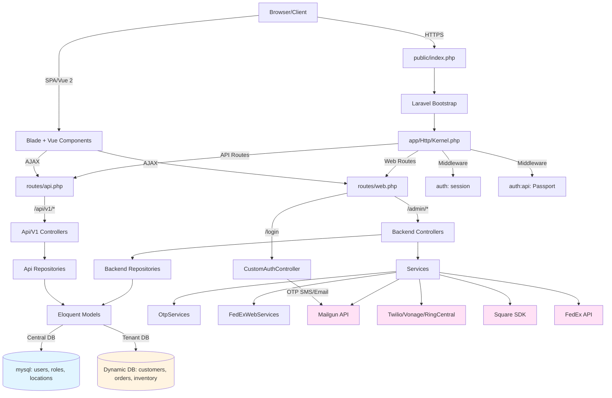

# Architecture Overview

The Boca 340B Insights system follows a layered architecture pattern with clear separation of concerns.

## System Layers

1. **UI Layer**: Blade templates + Vue 2 components
2. **Routing Layer**: Web routes (`/admin/*`) and API routes (`/api/v1/*`)
3. **Controller Layer**: Backend, Frontend, and API controllers
4. **Repository Layer**: Data access abstraction
5. **Service Layer**: Business logic and external integrations
6. **Model Layer**: Eloquent ORM with multi-database support
7. **Database Layer**: Central DB (users, locations) + Tenant DBs (customers, orders, inventory)

## High-Level Architecture Diagram



## Key Architectural Patterns

- **Multi-Database Tenancy**: Models dynamically select DB connections based on session `userLocation`
- **Repository Pattern**: Controllers → Repositories → Models
- **Service Layer**: Business logic extracted to Services (OtpServices, FedExWebServices)
- **Event-Driven**: Events/Listeners for side effects (emails, notifications)

## Data Flow

**Web Admin Flow:**
```
User → /login → CustomAuthController → OTP → Session (userLocation) 
→ /admin/dashboard → Backend Controllers → Repositories → Models → Tenant DB
```

**API Flow:**
```
Client → /api/v1/auth/login → Passport Token → /api/v1/* 
→ Api Controllers → Repositories → Models → DB
```
