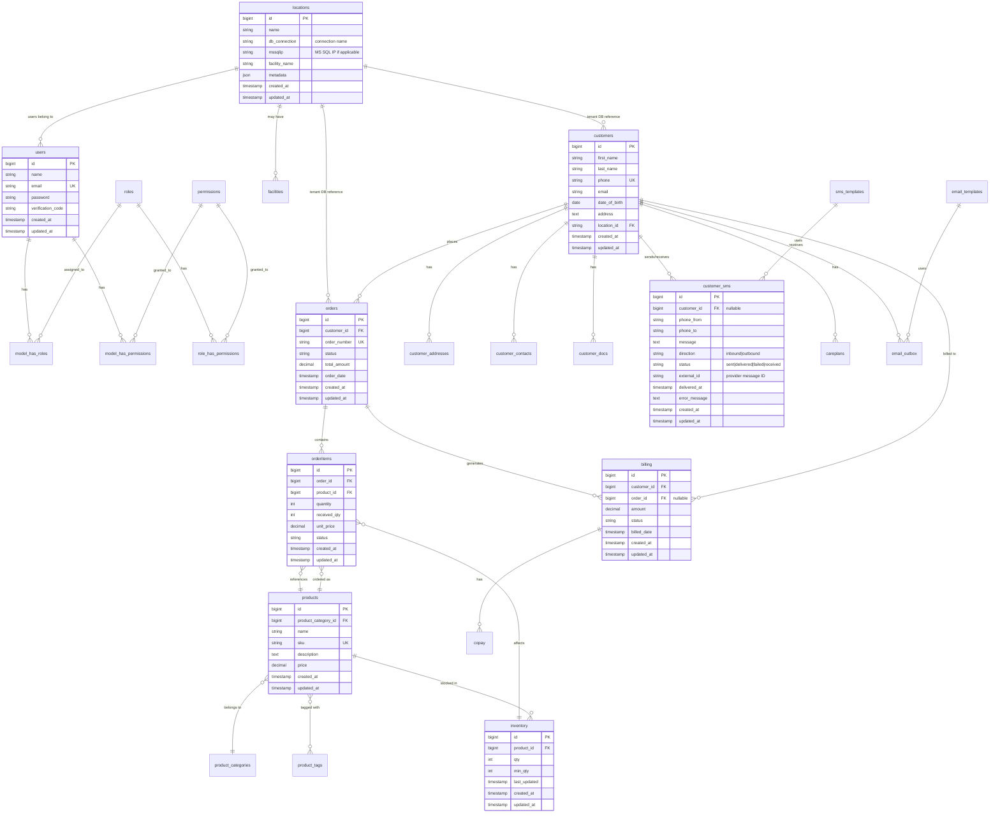

# Database Entity Relationship Diagram

The Boca 340B Insights system uses a multi-database architecture with:

- **Central Database** (`mysql` connection): Stores cross-tenant configuration, user accounts, roles/permissions, and location metadata
- **Tenant Databases** (dynamic connection per location): Store operational data per location/facility (isolated per tenant)

## Entity Relationship Diagram



## Database Architecture

### Central Database (`mysql` connection)

**Purpose:** Stores cross-tenant configuration and metadata.

**Tables:**
- `users` - User accounts (admins, staff)
- `roles`, `permissions` - Spatie Permission (RBAC)
- `model_has_roles`, `model_has_permissions`, `role_has_permissions` - Permission assignments
- `locations` - Facility/location metadata (includes `db_connection`, `mssqlip`)
- `facilities` - Facility details (if separate from locations)

### Tenant Databases (Dynamic connection per location)

**Purpose:** Store operational data per location/facility (isolated per tenant).

**Tables:**
- `customers`, `customer_addresses`, `customer_contacts`, `customer_docs`
- `orders`, `orderitems`
- `inventory`, `products`, `product_categories`, `product_tags`
- `customer_sms`, `email_outbox`, `email_templates`, `sms_templates`
- `billing`, `copay`, `expenses`
- `drugs`, `refills`, `careplans`
- ... (operational tables per location)

**Connection Selection:**
Tenant models set `$this->connection` dynamically based on session:
```php
$this->connection = session()->get('userLocation')->db_connection;
```

## Key Relationships

### Central Database
- `users` → `roles` (via `model_has_roles`) - Many-to-many
- `users` → `permissions` (via `model_has_permissions`) - Many-to-many
- `roles` → `permissions` (via `role_has_permissions`) - Many-to-many
- `users` → `locations` - Users assigned to locations

### Tenant Databases
- `customers` → `customer_addresses`, `customer_contacts`, `customer_docs` - One-to-many
- `customers` → `orders` - One-to-many
- `orders` → `orderitems` - One-to-many
- `orderitems` → `products` - Many-to-one
- `products` → `inventory` - One-to-one/one-to-many
- `customers` → `customer_sms` - One-to-many (nullable if unlinked SMS)
- `orders` → `billing` - One-to-one/one-to-many
- `customers` → `billing` - One-to-many

## Multi-Database Connection Pattern

**Central DB Models:**
```php
// app/Models/Location.php
protected $connection = 'mysql';
```

**Tenant DB Models (Dynamic):**
```php
// app/Models/Customer.php
public function __construct(array $attributes = [])
{
    parent::__construct($attributes);
    $location = session()->get('userLocation');
    if ($location) {
        $this->connection = $location->db_connection;
        $this->table = $location->database_name . '.customers';
    }
}
```

## Key Takeaways

✅ **Central DB**: Users, roles, permissions, locations (shared across tenants)  
✅ **Tenant DBs**: Customers, orders, inventory, SMS, billing (isolated per location)  
✅ **Dynamic Connection**: Models set `$this->connection` from `session('userLocation')->db_connection`  
✅ **Relationship Boundaries**: Relationships typically stay within same database (central or tenant)  
⚠️ **Cross-DB Relationships**: No direct FK relationships between central and tenant DBs (reference by ID only)
