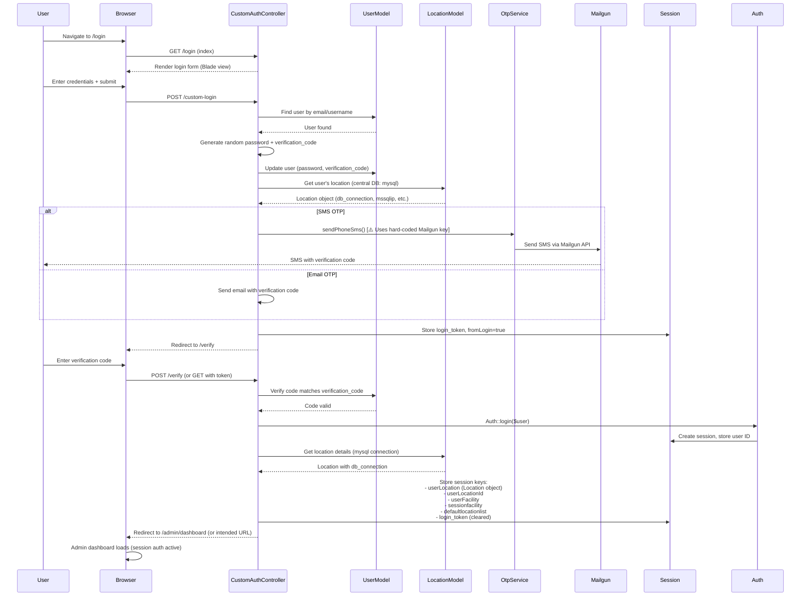

# Authentication Flow

This diagram shows the admin login flow with OTP (One-Time Password) verification.

**Route Path:** `GET /login` → `POST /custom-login` → `ANY /verify`  
**Controller:** `App\Http\Controllers\CustomAuthController`

## Sequence Diagram

## Flow Summary

1. User navigates to `/login` and sees login form
2. User submits credentials via `/custom-login`
3. System generates OTP (verification code) and sends via SMS or email
4. User enters verification code at `/verify`
5. System validates code and creates session with `Auth::login($user)`
6. Session stores location/facility data for multi-DB connection selection
7. User redirected to `/admin/dashboard`

## Database Connections

- **User lookup**: Central DB (`mysql` connection)
- **Location lookup**: Central DB (`mysql` connection)
- **After login**: Tenant models use `session('userLocation')->db_connection`

## Security Note

⚠️ **Hard-coded Mailgun API key** in `CustomAuthController::sendPhoneSms()`. See [Security & Authentication](../security/security-auth.md) for remediation details.
