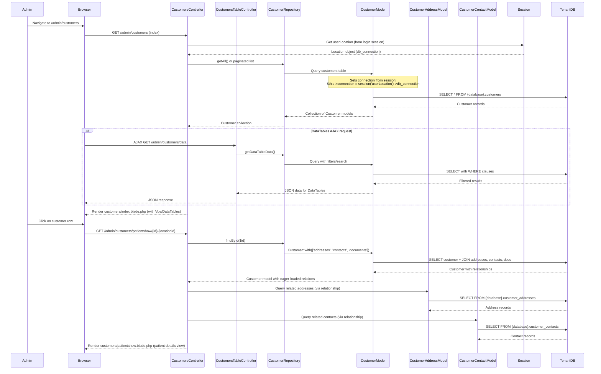

# Customer Management Flow

This diagram shows the customer/patient management lifecycle flow.

**Route Path:** `GET /admin/customers` → `GET /admin/customers/patientshow/{id}/{locationid}`  
**Controllers:** `Backend\Customers\CustomersController`, `Backend\Customers\CustomersTableController`

## Sequence Diagram

## Flow Summary

1. Admin navigates to `/admin/customers` (customer list page)
2. Controller gets location from session to select tenant database
3. Repository queries customer records from tenant DB
4. DataTables AJAX request (optional) provides filtered/sorted customer list
5. Admin clicks on customer row to view details
6. Controller loads customer with eager-loaded relationships (addresses, contacts, documents)
7. Patient detail view rendered with full customer information

## Database Connections

- **Customer queries**: Tenant DB (dynamic connection via `session('userLocation')->db_connection`)
- **Tables**: `{databaseName}.customers`, `{databaseName}.customer_addresses`, `{databaseName}.customer_contacts`

## Key Features

- **Multi-DB Connection**: Models dynamically select tenant DB based on session location
- **Repository Pattern**: Controllers use repositories for data access
- **Eager Loading**: Relationships loaded via Eloquent `with()` to avoid N+1 queries
- **DataTables Integration**: AJAX-powered filtering, sorting, and pagination
