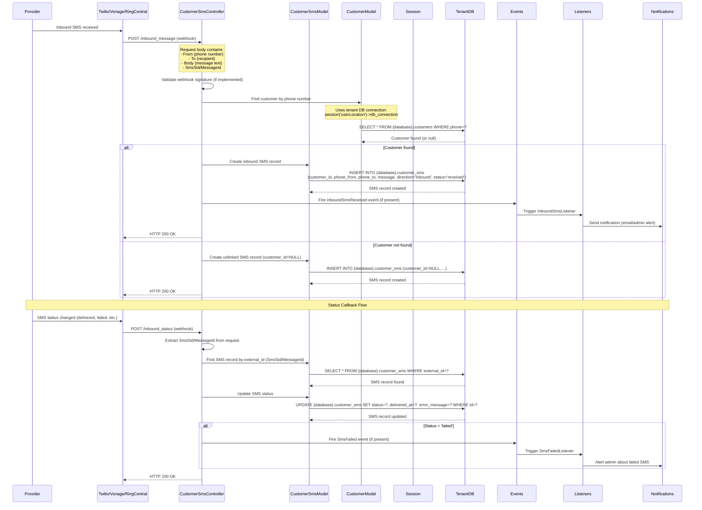

# Inbound SMS Flow

This diagram shows the inbound SMS webhook processing and status callback flow.

**Route Path:** `POST /inbound_message`, `POST /inbound_status`  
**Controller:** `Backend\CustomerSms\CustomerSmsController`

## Sequence Diagram

## Flow Summary

### Inbound Message Flow

1. SMS provider receives inbound SMS from customer
2. Provider sends webhook to `/inbound_message`
3. Controller validates webhook signature (if implemented)
4. Controller looks up customer by phone number
5. Controller creates SMS record in tenant DB (linked to customer if found)
6. Event fired (if present) to trigger notifications
7. HTTP 200 OK returned to provider

### Status Callback Flow

1. SMS provider updates SMS delivery status (delivered, failed, etc.)
2. Provider sends webhook to `/inbound_status`
3. Controller finds SMS record by external ID (provider message ID)
4. Controller updates SMS status in tenant DB
5. If status is 'failed', event fired to alert admin
6. HTTP 200 OK returned to provider

## Database Connections

- **CustomerSms queries**: Tenant DB (dynamic connection via `session('userLocation')` or default tenant DB)
- **Tables**: `{databaseName}.customer_sms`, `{databaseName}.customers`

## Data Written/Updated

1. **`customer_sms` table (inbound_message)**:
   - `customer_id` - Linked customer (or NULL if not found)
   - `phone_from` - Sender phone number
   - `phone_to` - Recipient phone number
   - `message` - SMS body text
   - `direction` - 'inbound'
   - `status` - 'received'
   - `external_id` - Provider message ID (SmsSid/MessageId)

2. **`customer_sms` table (inbound_status)**:
   - `status` - Updated to 'delivered', 'failed', 'undelivered', etc.
   - `delivered_at` - Timestamp (if delivered)
   - `error_message` - Error details (if failed)

## Key Features

- **Webhook Processing**: Receives SMS from multiple providers (Twilio, Vonage, RingCentral)
- **Customer Linking**: Attempts to link SMS to customer by phone number
- **Status Tracking**: Updates SMS delivery status via callback webhooks
- **Event-Driven**: Fires events for notifications/alerts (if implemented)

## Security Considerations

⚠️ **Webhook Validation**: Verify signature validation is implemented for SMS webhook endpoints. Each provider (Twilio, Vonage, RingCentral) has different signature validation methods.
