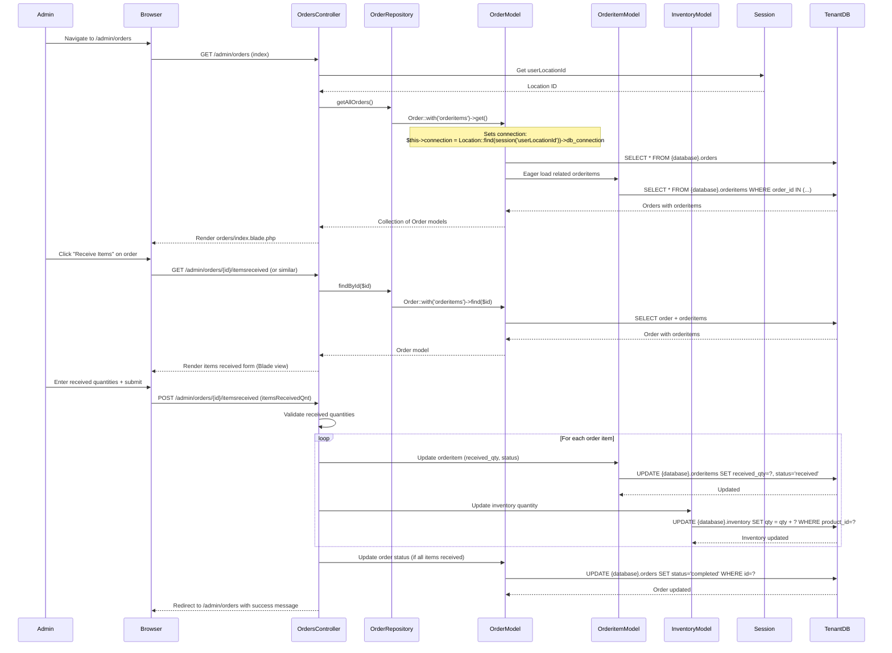

# Order Receiving Flow

This diagram shows the order receiving and inventory update flow.

**Route Path:** `GET /admin/orders` → `POST /admin/orders/{id}/itemsreceived`  
**Controller:** `Backend\Orders\OrdersController`

## Sequence Diagram

## Flow Summary

1. Admin navigates to `/admin/orders` (order list page)
2. Controller loads orders with eager-loaded order items
3. Admin clicks "Receive Items" on an order
4. Controller displays receive items form with order items
5. Admin enters received quantities for each item and submits
6. Controller validates and updates order items (`received_qty`, `status`)
7. Controller updates inventory quantities (increments stock)
8. If all items received, order status updated to 'completed'
9. Redirect to order list with success message

## Database Connections

- **Order/Orderitem queries**: Tenant DB (dynamic connection via `session('userLocationId')` → `Location::find(...)->db_connection`)
- **Tables**: `{databaseName}.orders`, `{databaseName}.orderitems`, `{databaseName}.inventory`

## Data Updated

1. **`orderitems` table**:
   - `received_qty` - Quantity received
   - `status` - Updated to 'received'

2. **`inventory` table**:
   - `qty` - Incremented by received quantity

3. **`orders` table**:
   - `status` - Updated to 'completed' if all items received

## Key Features

- **Multi-DB Connection**: Orders use tenant DB based on session location
- **Inventory Management**: Receiving orders automatically updates inventory quantities
- **Status Tracking**: Order and order item status updated throughout the flow
- **Eager Loading**: Order items loaded with orders to avoid N+1 queries
